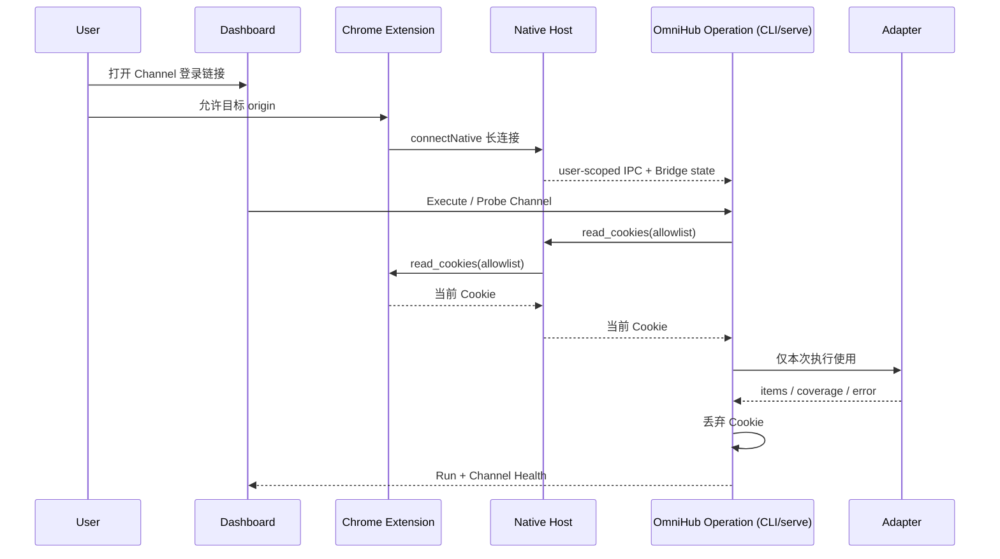

# OmniHub Public Contract

状态：`ready`

本文定义 CLI、HTTP、MCP、View refresh 与 Web Dashboard Backend 共享的领域合同。实现阶段以同一模型生成 JSON Schema、OpenAPI、MCP Tool Schema 和 CLI command manifest；Dashboard 不另造结果状态。

## 1. Operation Request

```json
{
  "schema_version": "1.0",
  "operation": "search",
  "query": "agent search infrastructure",
  "target": null,
  "scope": {
    "channels": ["channel_github_official"],
    "sources": ["github"],
    "providers": ["github-api", "tavily"],
    "domains": [],
    "collection": null
  },
  "route_policy": {
    "mode": "auto",
    "prefer": [{"kind": "channel", "id": "channel_github_official"}],
    "only": [],
    "exclude": [],
    "aggregate": false,
    "allow_fallback": true
  },
  "limit": 20,
  "time_range": {"from": null, "to": null},
  "identity_dedupe": "exact",
  "similarity_grouping": "off",
  "continuation": null,
  "deadline_ms": 30000
}
```

约束：

- `operation` 为 `search | latest | fetch`；`health` 通过 doctor/readiness 合同暴露，`refresh` 是 View 编排操作，不是 Provider Capability。
- `search` 要求 `query`；`fetch` 要求 `target`；`latest` 不接受 query。
- `scope` 至少给出 Channel、Source、Provider、Domain、Collection 之一，除非所选 Provider Descriptor 明确允许 global discovery。
- `scope.sources` 表示内容来源，`scope.providers` 表示允许使用的检索服务/工具，两者不可混为一个枚举。
- `route_policy` 是选择 Channel 的策略；`mode` 为 `auto | prefer | only | exclude`。`aggregate=false` 时每个 Source 默认只执行一个首选 Channel；`allow_fallback` 控制失败后能否改走已披露的备选 Channel。`prefer/only/exclude` 的 selector 必须显式标注 `channel | provider`，不能靠 ID 字符串猜类型。
- `identity_dedupe` v1 为 `none | exact`；`similarity_grouping` 为 `off | title | content`，分组不删除不同 Item。
- `continuation` 只能使用 OmniHub 签发的不透明 token；调用方不能传 Adapter cursor。

## 2. Result Envelope

```json
{
  "schema_version": "1.0",
  "request_id": "req_01...",
  "status": "partial",
  "request": {
    "schema_version": "1.0",
    "operation": "search",
    "query": "agent search infrastructure",
    "scope": {"sources": ["github"]},
    "route_policy": {"mode": "auto", "aggregate": false, "allow_fallback": true},
    "limit": 20,
    "time_range": {},
    "identity_dedupe": "exact",
    "similarity_grouping": "off",
    "deadline_ms": 30000
  },
  "executions": [],
  "items": [],
  "coverage": [],
  "errors": [],
  "continuation": {
    "token": null,
    "mode": "none",
    "limitations": ["multi_route_first_window_only"]
  },
  "meta": {
    "started_at": "2026-08-13T10:00:00Z",
    "finished_at": "2026-08-13T10:00:01Z",
    "duration_ms": 1000,
    "result_count": 12
  }
}
```

`status`：

- `complete`：所有已选择的必需 Channel 成功，且没有影响请求承诺的覆盖缺口。
- `partial`：至少一个 Channel 成功或产生有效 Item，但有 Channel 失败、回退或明确截断。
- `failed`：请求合法，但没有 Channel 成功完成。

空结果不自动等于失败；如果 Channel 成功且穷尽了 RouteTemplate 声明的范围，可以是 `complete`。

## 3. RouteTemplate、Channel 与执行记录

静态 Descriptor：

```json
{
  "route_template_id": "x-xurl-recent-search",
  "source_constraint": {"kind": "exact", "values": ["x"]},
  "provider": "xurl",
  "adapter": "command",
  "capabilities": ["search"],
  "content_level": "metadata",
  "pagination": {"kind": "cursor", "globally_mergeable": false},
  "time_range": {"kind": "recent_window", "value": "provider_defined"},
  "auth": {
    "kind": "x_developer_app",
    "required": true,
    "login_url": "https://developer.x.com/en/portal/dashboard"
  },
  "cost": "metered",
  "trust": "local_executable",
  "limitations": ["x_recent_search_window"]
}
```

RouteTemplate 只是能力声明。用户 Channel 才绑定实际配置：

```json
{
  "id": "channel_x_official",
  "source": "x",
  "route_template_id": "x-xurl-recent-search",
  "endpoint_profile_id": "xurl-default",
  "credential_id": "cred_x_developer",
  "parameters": {"max_results": 20},
  "priority": 100,
  "fallback_channel_ids": [],
  "enabled": true,
  "revision": 3
}
```

执行记录：

```json
{
  "channel_id": "channel_x_official",
  "route_template_id": "x-xurl-recent-search",
  "source": "x",
  "provider": "xurl",
  "endpoint": "xurl-default",
  "capability": "search",
  "selection": "preferred",
  "status": "completed",
  "reason": null,
  "started_at": "2026-08-13T10:00:00Z",
  "duration_ms": 420,
  "examined": 20,
  "returned": 10,
  "auth": {"required": true, "used": true, "credential_id": "cred_x_developer"},
  "limitations": ["x_recent_search_window"]
}
```

`status` 为 `completed | failed | skipped`。Execution 只记录 Endpoint/Credential ID，不复制 API Key 或 Cookie。

## 4. Item 与 Observation

Item 借用 JSON Feed 1.1 的内容语义，但保留搜索与聚合所需字段：

```json
{
  "id": "itm_01...",
  "url": "https://example.com/post/123",
  "external_url": null,
  "title": "Example",
  "content": {
    "role": "snippet",
    "text": "Search-result excerpt",
    "html": null,
    "source_supplied": true
  },
  "summary": null,
  "image": null,
  "banner_image": null,
  "published_at": "2026-08-13T08:00:00Z",
  "modified_at": null,
  "authors": [{"name": "Alice", "url": null, "avatar": null}],
  "tags": ["agent"],
  "language": "en",
  "attachments": [],
  "metrics": {"stars": 42},
  "observations": [],
  "identity": {
    "cluster_id": "idn_01...",
    "reason": "canonical_url"
  },
  "similarity": {
    "group_id": null,
    "strategy": "off"
  }
}
```

规则：

- `content.role` 为 `snippet | summary | body`；只有确认读取正文时才能写 `body`。
- 时间统一输出 RFC 3339 UTC，无法确定则省略。
- `metrics` 是可扩展 map；语义不同的同名指标必须 namespaced。
- `id` 是规范化对象 ID。相似报道仍有各自 Item ID，只共享 `similarity.group_id`。
- `search` 默认按归一化 Channel rank 合并并稳定打破平局；`latest` 默认按时间排序。跨 Provider score 不被假设为同一量纲。

Observation 记录每条获取路径：

```json
{
  "source": "github",
  "provider": "tavily",
  "channel_id": "channel_web_tavily",
  "route_template_id": "web-via-tavily",
  "endpoint": "tavily-default",
  "upstream_id": null,
  "original_url": "https://github.com/owner/repo",
  "canonical_url": "https://github.com/owner/repo",
  "retrieved_at": "2026-08-13T10:00:01Z",
  "rank": 1,
  "score": null,
  "verification": "candidate",
  "limitations": ["web_index_coverage_unknown"]
}
```

`verification` 为 `candidate | metadata | body`。identity 合并必须保留全部 Observation；Tavily 发现 GitHub URL 时，Source 是 `github` 或目标域名，Provider 仍是 `tavily`。

## 5. Coverage

```json
{
  "source": "feed:linux-do-latest",
  "channel_id": "channel_linux_do_direct",
  "route_template_id": "direct-feed-latest",
  "scope": "upstream_feed_window",
  "from": null,
  "to": "2026-08-13T10:00:00Z",
  "examined": 30,
  "returned": 6,
  "exhaustive": false,
  "truncated": true,
  "limitations": ["upstream_retention_unknown"]
}
```

Coverage 是观察事实，不是置信度。无法获知时间窗、examined 或 exhaustive 时省略字段并填写 limitation。Feed window、recent search、Web index 和本地 snapshot 使用不同的 `scope`。

## 6. Error

```json
{
  "code": "rate_limited",
  "message": "GitHub API rate limit exceeded",
  "source": "github",
  "provider": "github-api",
  "channel_id": "channel_github_official",
  "route_template_id": "github-native-search",
  "retryable": true,
  "retry_after_ms": 60000,
  "details": {"status": 403}
}
```

`code` 至少包括 `parameter_error | config_error | auth_error | rate_limited | timeout | network_error | upstream_error | protocol_error | parse_error | internal_error`。默认 details 只保留脱敏上下文。

## 7. Source、RouteTemplate、Channel 与认证资源

### 7.1 受信任 RouteTemplate

```yaml
apiVersion: omnihub.dev/v1alpha1
kind: RouteTemplate
metadata:
  id: x-twscrape-search
  origin: builtin
spec:
  provider: twscrape
  adapter: command
  capabilities: [search]
  sourceConstraint:
    kind: exact
    values: [x]
  parametersSchema:
    type: object
    properties:
      limit: {type: integer, minimum: 1, maximum: 100}
  auth:
    kind: browser_cookie
    browser: chrome
    loginUrl: "https://x.com/i/flow/login"
    permissionOrigins: ["https://x.com/*"]
    cookieScope:
      url: "https://x.com/"
      allowedDomains: ["x.com", ".x.com"]
      names: [auth_token, ct0]
      store: current
      partitions: [unpartitioned]
  limitations: [user_opt_in_only, x_terms_apply]
```

RouteTemplate 声明允许的 Source constraint、Provider、权限 origin pattern、实际 Cookie query scope、参数和限制，自身不可运行。Chrome permission pattern 与 `chrome.cookies` 的 URL/domain/name/store/partition 不能混为一个字段。`sourceConstraint` 至少支持 `exact | any_registered | domain_pattern`；具体 Source 始终由 Channel 绑定。`builtin` Template 随版本发布且只读；imported Template 在用户审核 browser scope 并提升为 trusted 前不能创建启用的 Cookie Channel。

### 7.2 EndpointProfile

```yaml
apiVersion: omnihub.dev/v1alpha1
kind: EndpointProfile
metadata:
  id: rsshub-local
spec:
  provider: rsshub
  baseUrl: http://127.0.0.1:1200
  trust: local
  timeout: 10s
```

Endpoint 只描述连接实例和 transport；账号凭据由 Channel 引用 Credential，避免一个 Endpoint 被误绑定成一个账号。

### 7.3 Credential

创建/修改 API Key：

```json
{
  "id": "cred_tavily_personal",
  "provider": "tavily",
  "auth_kind": "api_key",
  "label": "Personal Tavily",
  "value": "tvly-example-not-a-real-key",
  "enabled": true
}
```

SQLite 的 `credentials` 记录直接保存 `value`；不创建 Keychain handle。普通列表返回：

```json
{
  "id": "cred_tavily_personal",
  "provider": "tavily",
  "auth_kind": "api_key",
  "label": "Personal Tavily",
  "has_value": true,
  "value_masked": "••••-key",
  "enabled": true,
  "revision": 4
}
```

`GET /v1/credentials/{id}?include_value=true` 可在本地显式返回完整 `value`，响应带 `Cache-Control: no-store`。列表、日志、Run、Error、readiness 和默认 export 不得携带完整值。

Chrome Cookie 使用 `auth_kind=chrome_cookie` 的 Credential，但 `value` 始终为 null；Cookie 在每次 Execute/Probe 时从当前 Chrome Bridge 读取，不落库。

### 7.4 Channel

```yaml
apiVersion: omnihub.dev/v1alpha1
kind: Channel
metadata:
  id: channel_v2ex_rsshub
  origin: user
  revision: 3
spec:
  source: v2ex
  routeTemplate: v2ex-rsshub-latest
  endpointProfile: rsshub-local
  credential: null
  parameters:
    path: /v2ex/topics/latest
    limit: 50
  priority: 50
  fallbackChannels: [channel_v2ex_direct]
  enabled: true
```

Direct Feed URL、RSSHub path/parameters、Endpoint、Credential、priority/fallback 与 Collection membership 都落在 user-owned Channel。参数必须按 RouteTemplate/RSSHub metadata 校验，不能从浏览器输入直接拼 URL。

配置来源分为 `builtin | imported | user`：builtin RouteTemplate 只读，用户通过 Channel/overlay 个性化；imported 资源需审核后启用。远程查询结果不得指定 executable、login URL 或 Cookie scope。

### 7.5 Channel Health

```json
{
  "channel_id": "channel_x_cookie_search",
  "desired_state": "enabled",
  "readiness": "needs_login",
  "action_required": {
    "kind": "open_login",
    "url": "https://x.com/i/flow/login"
  },
  "checks": [
    {"kind": "configuration", "status": "passed", "checked_at": "2026-08-13T10:00:00Z"},
    {"kind": "browser_bridge", "status": "passed", "checked_at": "2026-08-13T10:00:00Z"},
    {"kind": "browser_permission", "status": "passed", "checked_at": "2026-08-13T10:00:00Z"},
    {"kind": "credential", "status": "passed", "code": "chrome_runtime", "checked_at": "2026-08-13T10:00:00Z"},
    {"kind": "endpoint", "status": "not_run", "checked_at": null},
    {"kind": "channel_probe", "status": "failed", "code": "cookie_missing", "checked_at": "2026-08-13T10:00:00Z"}
  ],
  "last_successful_probe_at": null,
  "last_execution": null
}
```

`desired_state` 为 `enabled | disabled`；`readiness` 为 `unknown | not_configured | needs_permission | needs_login | blocked | ready | degraded`。`browser_unavailable`、`cookie_missing` 等是 check/error code，不是 readiness 枚举。禁用 Channel 表达为 `desired_state=disabled` 与 `readiness=blocked`、reason=`disabled_by_user`。它是 `checks[]` 的派生读模型；`checks` 各自携带 checked/expires 时间和脱敏错误。`last_execution` 是独立事实，不能覆盖 readiness。只有真实 Channel Probe 成功且证据未过期才能成为 `ready`。

## 8. Provider Binding

v1 不定义新的 External Adapter Protocol。

### 8.1 Built-in binding

- `feed`：RSS/Atom/JSON Feed。
- `rsshub`：RSSHub Route 与 Endpoint 元数据。
- `http-json`：受信任 Manifest 的受限 HTTP 请求和 JSON Pointer 字段映射；复杂签名/分页使用专用 Adapter。

### 8.2 Command binding

```yaml
binding:
  type: command
  executable: xurl
  argv:
    - {literal: search}
    - {from: request.query}
    - {literal: --max-results}
    - {from: request.limit, format: decimal}
  output:
    format: json
    itemsPointer: /data
```

- OmniHub 直接调用 executable + argv，不经过 shell。
- 每个 argv 元素只能是固定 literal 或单个经过类型校验的请求字段；禁止把用户输入拼入 shell/template 字符串。
- Credential value 不得出现在 argv；binding 只能声明受信任的 environment/stdin/auth-field mapping，任何诊断只显示 Credential ID。
- stdout 只接受 JSON/JSONL，stderr 是日志；超时、退出码和输出大小受限。
- binding 可以映射一个受支持的第三方 JSON schema，或要求 executable 直接输出 OmniHub Adapter Result；这只是输出合同，不新增进程握手/生命周期协议。

### 8.3 MCP binding

示意如下；真实 `tool` 名称必须由 `tools/list` 发现后固定到受信任 Source Bundle，不能凭文档猜测：

```yaml
binding:
  type: mcp
  server: x-api
  tool: <discovered-search-tool>
  arguments:
    query: {from: request.query}
    max_results: {from: request.limit}
  output:
    schema: x-api-search-v1
```

MCP binding 使用标准 initialize/capability negotiation、tools/list、tools/call、取消和 transport；OmniHub 不复制 MCP 生命周期。Tool 应声明 `outputSchema`，否则必须配置受信任的 JSON Pointer mapping。

## 9. View、State 与 Feed

View 保存规范化后的 Operation Request；Snapshot 是一次成功物化的不可变 Envelope 子集。Channel State 的逻辑 key 为：

```text
channel + route_template + endpoint + normalized_parameters + credential_id + credential_revision
```

API Key/Token 值不进入 key；Credential revision 变化会隔离旧 cache/checkpoint/tombstone。Chrome Cookie 账号不会被复制或指纹化；用户切换账号时新建 Credential/Channel，使新的 ID/revision 隔离状态。checkpoint 与新 snapshot 必须在同一事务提交，失败刷新不推进 checkpoint。

已确认的 `serve` 行为：

- 有未过期快照：直接返回。
- 有过期快照：返回 stale snapshot，并对同一 View singleflight 后台 refresh。
- 无快照：执行一次受 deadline 限制的阻塞 refresh；失败则返回明确错误，不生成空 Feed 冒充成功。
- 显式 `omnihub refresh <view>` 与外部 cron 始终可用；v1 不内置 scheduler。

Feed 路径：

- `/feeds/{view}.json`：JSON Feed 1.1，扩展位于 `_omnihub`。
- `/feeds/{view}.rss`：RSS 2.0 + `omnihub` namespace。
- `/feeds/{view}.atom`：Atom + `omnihub` extension。

Feed 支持 ETag/Last-Modified，并暴露 snapshot 时间与 stale 状态。

## 10. Run

所有 Dashboard 发起的 refresh 和已确认的临时 Query Workbench 都使用持久化 Run：

```json
{
  "id": "run_01...",
  "kind": "view_refresh",
  "resource": {"type": "view", "id": "view_daily"},
  "status": "running",
  "request_id": "req_01...",
  "idempotency_key": "refresh:view_daily:client-token",
  "created_at": "2026-08-13T10:00:00Z",
  "started_at": "2026-08-13T10:00:00Z",
  "finished_at": null,
  "claimed_by": "instance_01...",
  "lease_expires_at": "2026-08-13T10:00:30Z",
  "attempt": 1,
  "progress": {"channels_total": 3, "channels_finished": 1},
  "result": null,
  "last_error": null,
  "revision": 4
}
```

`status` 为 `queued | running | complete | partial | failed | cancelled`。Run 完成后 `result` 引用或内嵌同一 Result Envelope；进度只是已提交的 Channel 事实，不允许前端根据百分比推断最终成功。

Run claim/renew/finish 使用 compare-and-swap revision 与 lease。SQLite v1 仍走同一状态转换；未来 MySQL 多实例不得重新定义 Run 语义。进程内 singleflight 只减少本机重复执行，不能代替持久 Run 幂等和 lease。

## 11. OPML 与 Source Bundle

- OPML 2.0 import/export 只承诺保真保存 Direct Feed Channel 与 Collection 层级；未知 attribute 按标准忽略或保留扩展。
- RSSHub、GitHub、Tavily、X 等非 Feed RouteTemplate/Channel 使用 OmniHub Source Bundle YAML。
- 所有 export 只包含 credential reference，不导出 secret。

## 12. Dashboard 管理合同

### 12.1 通用资源字段

```json
{
  "id": "src_v2ex",
  "origin": "user",
  "enabled": true,
  "revision": 3,
  "created_at": "2026-08-13T09:00:00Z",
  "updated_at": "2026-08-13T10:00:00Z"
}
```

- `origin` 为 `builtin | imported | user`。
- `PATCH/DELETE` 必须携带 `If-Match` 或等价 expected revision；冲突返回 RFC 9457 `409 Conflict`。
- `POST` 支持 `Idempotency-Key`；同 key、同 payload 返回原结果，不同 payload 返回冲突。
- `builtin` 资源不能直接修改/删除；disable/overlay 产生 user-owned 配置。
- Credential create/update 可以接收完整 API Key/Token；列表只给 `has_value/value_masked`，detail 在 `include_value=true` 时可返回完整值并使用 `Cache-Control: no-store`。Cookie 永不通过 HTTP API 返回。日志、Run、Error、readiness 和默认 export 始终脱敏。

### 12.2 v1 Backend 资源

| 用户任务 | API | 返回的承重字段 |
|---|---|---|
| 查看实例概览 | `GET /v1/dashboard/summary` | version/instance、readiness 摘要、View freshness、活跃 Run、近期失败计数 |
| 查看 Source/RouteTemplate | `GET /v1/sources`、`GET /v1/route-templates` | 静态 Descriptor、Capability、auth/cost/limitations、origin/trust |
| 管理 Channel | `GET/POST /v1/channels`、`GET/PATCH/DELETE /v1/channels/{id}` | Template/Endpoint/Credential/parameters/priority/fallback、revision、Channel Health |
| 管理 Endpoint | `GET/POST /v1/endpoint-profiles`、`GET/PATCH/DELETE /v1/endpoint-profiles/{id}` | base URL 的安全显示、trust、Endpoint probe 摘要 |
| 管理 Credential | `GET/POST /v1/credentials`、`GET/PATCH/DELETE /v1/credentials/{id}` | provider/auth kind/label/value、掩码、revision；detail 可显式 include value |
| 管理 Chrome 连接 | `GET /v1/browser-bridges`、`GET /v1/channels/{id}/chrome/authorization-descriptor`、`POST /v1/browser-bridges/{id}/permissions/revoke` | connected/profile、登录/授权描述、granted origins、last seen/error；Extension 自行重连，无 Cookie |
| 管理 Collection | `GET/POST /v1/collections`、`GET/PATCH/DELETE /v1/collections/{id}` | Channel membership、revision |
| 管理 View | `GET/POST /v1/views`、`GET/PATCH/DELETE /v1/views/{id}` | 规范化 Operation、`fresh|stale|refreshing|empty|failed`、Feed URLs、最近成功与最近失败并存 |
| 读取 Snapshot/Item | `GET /v1/views/{id}/snapshot`、`GET /v1/views/{id}/items` | Snapshot metadata、Item/Observation、opaque pagination |
| 启动刷新 | `POST /v1/views/{id}/refresh` | `202 Accepted` + Run |
| 临时查询 | `POST /v1/runs`，kind=`query` | `202 Accepted` + Run；显式 scope/provider/trust/cost |
| 查看运行 | `GET /v1/runs`、`GET /v1/runs/{id}` | Run 状态、Channel progress、Envelope/result/error |
| 探测渠道 | `POST /v1/channels/{id}/probe` | `202 Accepted` + Run |
| 诊断 | `GET /v1/readiness` | 可按 source/provider/endpoint/template/channel 筛选的分层 readiness 与 Probe 时间 |

`dashboard/summary` 是这些资源的只读聚合，不成为新的状态来源。v1 前端轮询 Run；不提供 SSE/WebSocket。Query Workbench 已进入 v1，但不能默认广播所有 Provider。

### 12.3 View 可呈现状态

- `fresh`：最近成功 Snapshot 在 freshness window 内。
- `stale`：存在可读的旧 Snapshot，但已过期且当前没有刷新。
- `refreshing`：存在 active Run；若也有旧 Snapshot，两种事实同时返回。
- `empty`：尚无成功 Snapshot，且没有最近确定失败。
- `failed`：没有可读 Snapshot，最近 Run 失败。

“最近成功 Snapshot”与“最近 refresh 失败”是两个正交字段；有旧数据且新刷新失败时不能只显示绿色或只显示失败。

### 12.4 Loopback 本机信任模型

v1 只绑定 `127.0.0.1` / `::1`，拒绝非 loopback Host，并对 Dashboard API 校验固定 Host、Origin 与 CORS。个人本地 MVP 不增加 Dashboard 登录、bootstrap secret 或 session/CSRF 系统；能读取用户 SQLite 文件的本机账号也能读取 API Key，这是明确接受的信任前提。普通日志、Run 与错误仍须脱敏。

若未来开放非 loopback 监听，本合同立即失效，必须另行 Shape TLS、身份、审计与多用户边界。

## 13. Chrome Companion 直接读取合同

### 13.1 Dashboard API

```text
GET  /v1/browser-bridges
GET  /v1/channels/{channel_id}/chrome/authorization-descriptor
POST /v1/channels/{channel_id}/probe
POST /v1/browser-bridges/{bridge_id}/permissions/revoke
```

`authorization-descriptor` 只返回受信任 RouteTemplate 的 login URL、permission origin pattern 与 Cookie query scope，不表示已经授权。Extension 必须在自己的用户可见界面中调用 `chrome.permissions.request`；成功后 Chrome 保存 origin permission，OmniHub 不另建 consent/session 表。Dashboard 可先打开 login URL，再让用户点击 Extension 的“允许此站点”；实际 permission 状态以 Bridge health 为准。

`permissions/revoke` 请求体只含 `permission_origin_pattern`；Bridge 转发给 Extension 调用 `chrome.permissions.remove`，响应返回最新 granted origins。Bridge 离线时返回明确冲突，不把 SQLite 状态当成已撤销。

`GET /v1/browser-bridges` 返回：

```json
{
  "id": "chrome_default",
  "browser": "chrome",
  "connected": true,
  "profile_label": "Current Chrome profile",
  "granted_origins": ["https://x.com/*"],
  "last_seen_at": "2026-08-13T10:00:00Z",
  "last_error": null
}
```

### 13.2 Native Messaging 长连接

Extension 使用 `chrome.runtime.connectNative()` 启动 `omnihub chrome-host` 并保持双向 Port；断开后在 Chrome 仍运行时按有界 backoff 自动重连，不做紧循环。Host 同时监听当前 OS 用户专属的 Unix socket/Windows named pipe，CLI 与 `serve` 通过同一 Browser Bridge Client 连接。Chrome 通过 Host manifest 的 `allowed_origins` 限制发布的 Extension ID；Host 不信任 payload 自报 sender。

Bridge endpoint 使用当前用户确定性的 runtime path/name：Unix socket 权限为 `0600`，Windows named pipe ACL 只允许当前用户 SID；v1 不用额外 TCP 端口。Host 退出时清理 Unix socket，Client 对 stale socket/pipe 返回 `browser_unavailable`。

v1 同一 OS 用户同时只接受一个 Chrome Profile Bridge；先成功占用 endpoint 的连接为当前 Profile，额外连接返回 `bridge_already_active`。Dashboard 展示当前 `profile_label`，不扫描其他 Profile 或 Incognito。

Channel Execute/Probe 时，Operation Service 先根据当前 Channel、RouteTemplate 和 enabled/revision 做权威校验，再经 user-scoped IPC 向 Host 发出：

```json
{
  "protocol_version": "1.0",
  "type": "read_cookies",
  "request_id": "browserreq_01...",
  "channel_id": "channel_x_cookie_search",
  "permission_origin_pattern": "https://x.com/*",
  "cookie_scope": {
    "url": "https://x.com/",
    "allowed_domains": ["x.com", ".x.com"],
    "names": ["auth_token", "ct0"],
    "store": "current",
    "partitions": ["unpartitioned"]
  }
}
```

Extension 只需确认当前 Profile 已授予 `permission_origin_pattern`，按明确的 Cookie query scope 调用 `chrome.cookies` 并返回 name/value/domain/path/store/partition；它不自行解析 Channel 或 RouteTemplate。Operation Service 再检查响应没有超出请求 scope。Native Host/Operation process 只把值交给当前 Adapter execution；结束、取消或超时后立即释放，不写 SQLite、HTTP response、日志、Run 或 fixture。

### 13.3 执行流程



Chrome 或 Bridge 离线时，依赖 Cookie 的 Channel 立即以 check/error code `browser_unavailable` 失败，不尝试启动浏览器或无限等待；Channel readiness 派生为 `blocked`，若已有近期成功 Probe 证据则可为 `degraded`。其他 Channel 成功时总结果为 `partial`；View 保留最近成功 Snapshot。登录、permission、Bridge connected 和真实 Channel Probe 是分层证据，前三者不能单独产生 `ready`。

### 13.4 撤销

撤销通过 Extension 调用 `chrome.permissions.remove`。Bridge 下一次 health 同步后，依赖该 origin 的 Channel 进入 `blocked/browser_permission_missing`。OmniHub 没有 Cookie snapshot 可删，也不删除网站原 Cookie。

## 14. 公共出口映射

| 能力 | CLI | HTTP | MCP | Feed |
|---|---|---|---|---|
| search | `omnihub search` | `POST /v1/search` | `omnihub_search` | 保存 View 后投影 |
| latest | `omnihub latest` | `POST /v1/latest` | `omnihub_latest` | 保存 View 后投影 |
| fetch | `omnihub fetch` | `POST /v1/fetch` | `omnihub_fetch` | 不直接暴露 |
| refresh View | `omnihub refresh` | `POST /v1/views/{id}/refresh` | `omnihub_refresh_view` | 更新 Snapshot |
| readiness | `omnihub doctor --json` | `GET /v1/readiness` | `omnihub_doctor` | 不暴露 |
| manage | `omnihub sources/route-templates/channels/endpoints/credentials/collections/views/runs` | `/v1/*` 管理资源 | 后续按需暴露 | Dashboard |

映射规则：

- CLI：`complete/partial` 都返回 0；参数 3、配置/凭据 4、`failed` 5、内部错误 1。调用方必须解析 Envelope status。
- HTTP：预执行校验/配置错误用 RFC 9457 4xx；同步 `complete/partial` 为 200 + Envelope；合法执行但所有 Channel 失败为 502 + `failed` Envelope。异步操作返回 202 + Run，由 Run 终态承载 Envelope。
- MCP：`complete/partial` 使用 `isError=false` 和 structured content；请求无效或完全失败使用 tool error，并附可解析错误/Envelope。
- JSONL：逐行 Item 之外必须有显式 header/trailer 或 event type，不能因流式输出丢掉 Channel Execution、RouteTemplate、Coverage 与终态。

## 15. 分页合同

- Query Plane 多 Channel 一次性请求只承诺 bounded first window；无法稳定续页时不签发 token。
- 单 Channel 的 Provider cursor 留在 Adapter Result 内部，不直接暴露给调用方。
- 服务端 Query Session 或 View 可以保存每 Channel cursor、已消费位置与 merge buffer，并签发有 TTL 的 opaque continuation token。
- token 与原请求 scope/policy 绑定；参数变化后必须拒绝继续。

## 16. 版本策略

- JSON 顶层对象显式携带 `schema_version`；Manifest/Bundle 使用独立 `apiVersion`。
- v1 前允许 `v1alpha1`/`0.x` 破坏性迭代；1.0 后同一 major 只增加可选字段或枚举值。
- 未知可选字段应忽略；未知 operation、必需字段或 major version 必须拒绝。
- Command/MCP Provider 的第三方 output schema 单独版本化，不把它们误写成 OmniHub 自有传输协议。
