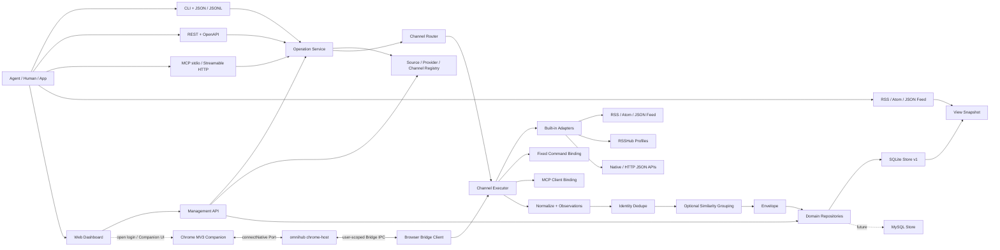
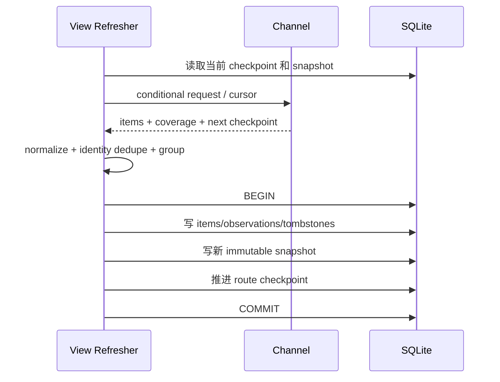

# OmniHub System Design

状态：`ready`

## 1. 承重判断

OmniHub 的核心不是“每个平台写一个 Adapter”，而是把用户关心的内容来源与实际获取手段分开：

- `Source` 回答“内容来自哪里”；
- `Provider` 回答“谁帮我们找到/取到”；
- `RouteTemplate` 回答“某类 Source 的某项 Capability 理论上可以怎样走”，只声明受信任能力和 Source constraint；
- `Channel` 是用户真正启停、配置、授权、探测和执行的 RouteTemplate 实例；
- `Adapter` 只翻译 Provider 协议。

因此同一个 X Source 可以同时拥有 xurl official、RSSHub timeline 和 twscrape cookie 三个 Channel，分别配置、授权和显示健康；同一个 V2EX Source 可以优先 Direct Atom Channel，RSSHub Channel 作为获准回退。Tavily 搜到 GitHub 页面时，Provider 是 Tavily，Source 仍是 GitHub/目标域名。

第二个承重判断是把一次性查询和持续订阅拆成两个运行平面。两者共享合同与执行内核，但只有 Subscription Plane 承担 SQLite、checkpoint、snapshot 和 Feed 新鲜度责任。综合 Web Dashboard 是 `serve` 上的管理投影：它读写同一 Registry/Repository 并复用 Operation/Envelope，不成为第三套业务内核。

第三个承重判断是“为 MySQL 留迁移边界”和“现在实现分布式”必须分开。v1 只交付 SQLite，但领域层只依赖 Repository/Unit of Work；全局 ID、revision、idempotency、Run lease 和事务不变量从第一阶段就成立。MySQL Driver、多实例部署和分布式调度留到真实需要时实现。

第四个承重判断是浏览器登录导航、Cookie 授权和 Channel 可用性是三件事。普通 Dashboard 页面不能跨站读取 Cookie；Chrome Companion 只在用户手势下获得目标 origin 权限，Native Host 在每次执行时把 allowlist 内的认证材料交给 Browser Bridge，最后还必须真实 Probe Channel 才能标记 ready。

## 2. 总体架构



凭据分两条简单路径：Dashboard 录入的 API Key/Token 直接保存在 SQLite Credential；Chrome Cookie 每次执行通过 Browser Bridge 进入 Adapter 内存，结束即丢弃。两者不再共用 Keychain/SecretStore 抽象。Credential detail 可以按本地用户请求返回完整 API Key，但日志、Run、Error、readiness、Cookie 和默认 export 不返回。

已确认 Go 单二进制作为 v1 技术底座：符合全局安装、跨平台、并发 I/O、本地 HTTP/MCP Server 的目标。SQLite 选择无需系统动态库的驱动，避免安装后再要求用户准备额外运行时。

目录只在纵切需要时增加，不先搭空包；当前与下一步的最小边界是：

```text
cmd/omnihub             进程入口
internal/core           Operation、Envelope、Item、Coverage、Error
internal/registry       Source/Provider/RouteTemplate/Channel/Profile/Collection
internal/router         Capability、Channel 与选择策略
internal/adapter        内建 Adapter 与 command/MCP bindings
internal/egress         Stage A profile、可信 transport 与 Probe trace
internal/browser        Stage D Native Host、permission、按执行 Cookie 请求
internal/semantic       Stage E embedding cache 与 grouping
internal/repository     领域 Repository、Unit of Work 与 contract
internal/store/sqlite   SQLite Repository 与 migration
internal/transport      CLI、HTTP、MCP、Feed、OPML、Dashboard API
schemas                 单一 Schema 源与生成产物
sources                 随版本发布的 Source Bundles
skills/omnihub          Agent Skill
```

## 3. 双运行平面

### 3.1 Query Plane

- `omnihub search/latest/fetch` 的无依赖基线可在没有 daemon 和数据库时运行，覆盖公开 Feed、无凭据 Provider 和调用方显式提供的环境变量凭据。使用 Dashboard 保存的 API Key Channel 时读取本机 SQLite；使用 Chrome Cookie Channel 时连接 Chrome 管理的 Browser Bridge IPC。依赖缺失必须返回 config/browser error，不能把“Query Plane 无状态优先”写成“所有 Channel 永远零依赖”。
- Registry、Channel Router、Adapter、Normalizer 和 Envelope 都在当前进程完成。
- 可以使用进程内/磁盘 response cache，但不承诺跨次全局分页、历史去重或 Feed 持续更新。
- 多 Channel 默认只取 bounded first window；coverage 如实标记截断。

### 3.2 Subscription Plane

- `omnihub serve` 暴露 HTTP、Streamable HTTP MCP、Feed 与 Dashboard Backend。
- View 保存 Operation，Snapshot 保存最近成功物化结果。
- SQLite Repository 维护用户 Channel/Endpoint/Credential 元数据、Channel checkpoint、缓存、identity tombstone、View、Snapshot、Run 和 readiness。
- Feed 只投影 Snapshot；它不是新的搜索实现。
- Dashboard 管理同一份 RouteTemplate、Channel、Endpoint、Credential、Collection、View、Run 与 readiness；前端由另一 Agent 实现。

把两者分开可以避免“为了输出 RSS，所有 CLI 用户都必须跑长期服务”，也避免让无状态 CLI 假装能提供稳定的跨 Provider continuation。

## 4. Registry 与 Router

### 4.1 Registry

Registry 合并四类配置，并保持静态能力与用户实例分离：

1. 随二进制发布的 Source/Provider/RouteTemplate Bundle；
2. 用户审核并导入的 Source Bundle 与 user-owned overlay；
3. 文件或 SQLite 中的 Channel、EndpointProfile、Credential 与 Collection；
4. OPML 导入后创建的 Direct Feed Channel 与 Collection membership。

OPML 是订阅交换而不是配置同步协议：普通 import 采用 additive merge，保留 Collection 既有 membership，再按文档顺序追加缺失 Channel；重复导入幂等，文档缺失项不触发 disable/退订。标准 URL/metadata 与 OmniHub identity extension 可回导，本地 priority/enabled/template/fallback/credential/endpoint 不进入 OPML。报告路径使用不透明稳定摘要，不把不可信 title/text 复制到日志或 Dashboard 响应。

Source tags 只用于发现；没有封闭类别枚举。RouteTemplate Descriptor 表达“理论支持”，Channel Probe 表达“当前这组 Endpoint、Credential 与参数真能执行”。

配置层级固定为 `builtin < imported < user overlay`：内建资源只读，升级时可替换；用户可以 disable 或 overlay，而不是直接修改随二进制发布的文件。Dashboard、CLI 和 import 都调用同一 Registry Command Service，不能各自维护配置副本。

### 4.2 默认选择算法

1. 展开 Collection、Source、Provider、Channel 与 domain scope，生成候选 Channel。
2. 依据每个 Channel 引用的 RouteTemplate，过滤不支持 Capability、分页/时间要求或内容层级要求的候选。
3. 应用 only/exclude/prefer、aggregate 和 fallback policy。
4. 做无网络 preflight：Channel 参数、Endpoint、Credential 是否存在、executable/MCP server 与 Chrome Bridge 依赖是否成立。
5. 按用户偏好、Source priority、readiness TTL、费用、信任边界和 timeout 排序。
6. `aggregate=false` 时每个 Source 只执行首选 Channel；失败后仅在 `allow_fallback=true` 时走已披露备选。
7. 记录所有 selected/completed/failed/skipped Channel、RouteTemplate 与选择原因。

默认不把一次查询广播给全部 Provider，因为这会同时增加费用、rate limit、隐私泄露和重复结果。

### 4.3 一般优先级

- Direct Feed：适合低成本 `latest`，也可以在已经取得的 bounded Feed window 内提供明确降级标记的本地 `search`；不等价于源站全量索引。
- Native API/official CLI：适合 `search`、结构化 metadata、指标和真实分页。
- RSSHub：适合把没有官方 Feed 的来源变成增量 Feed；不默认等价于平台搜索。
- Specialized command/MCP：适合 X 等已有专项工具的来源。
- Generic Web Search：适合发现候选 URL 和补充覆盖，不冒充目标站原生索引。

每个 Source Manifest 可以覆盖这套默认顺序。

## 5. Adapter 与扩展边界

核心 Go 接口保持窄而有意义：

```go
type Adapter interface {
    Describe(ctx context.Context, profile EndpointProfile) (Descriptor, error)
    Execute(ctx context.Context, req AdapterRequest) AdapterResult
    Health(ctx context.Context, check HealthCheck) HealthResult
}
```

`AdapterResult` 同时返回 Items、Coverage、Errors 与私有 Cursor；Adapter 不负责全局路由或跨 Route merge。

### 5.1 内建 Adapter

- `feed`：RSS/Atom/JSON Feed discovery、conditional GET、解析和 bounded window。
- `rsshub`：Endpoint 鉴权、Route metadata、Feed 获取与 Route 级诊断。
- `github`、`tavily`：首批高价值 Provider 的窄专用 HTTP Adapter，直接表达各自鉴权、分页、rate limit 与 provenance。

v1 不先实现通用 `http-json` mapping DSL；等第二个已验证 API 与现有专用 Adapter 真正同形时再抽取共同请求/解析逻辑。

v1 不内建通用 HTML/CSS scraping DSL：RSSHub/RSS-Bridge 已经解决这类扩展，OmniHub 若再造会迅速背上反爬和浏览器维护成本。

Stage 2 的 `feed` Adapter 只接受无 userinfo/credential query 的绝对 HTTP(S) URL，HTML discovery 只跟随一跳明确的 alternate Feed。文件缓存按 Channel、RouteTemplate、参数与额外分区生成 key，保存已成功解析的受限 body、ETag、Last-Modified 和 freshness；Query Plane 在 Adapter 之后统一做本地 search、闭区间 TimeRange、exact identity、排序与全局 limit，避免每个 Feed parser 各自解释请求。

### 5.2 Command binding

- 用户配置 executable 和由 literal/typed field 组成的 argv 数组；不经过 shell。
- Credential 不允许映射到 argv；受信任 binding 只能把 API Key/Token 注入子进程环境变量或 stdin，并在 error/trace 中统一脱敏。
- stdout 只能是 JSON/JSONL，stderr 是日志；规定 timeout、输出大小和 exit code 映射。
- 简单第三方 schema 使用版本化 JSON Pointer mapping；复杂工具应提供一个小型 adapter executable，直接输出 OmniHub Adapter Result。
- 这不是新 RPC 协议：没有 initialize/describe/shutdown JSONL 握手。

### 5.3 MCP binding

OmniHub 作为 MCP client 使用标准 stdio/Streamable HTTP、initialize、tools/list、tools/call、取消和 outputSchema。它只维护 Provider Tool 与 OmniHub 字段的 mapping，不复制一套生命周期协议。

### 5.4 明确不采用

- Go plugin：ABI、构建版本和分发耦合太强。
- 远程 Manifest 任意 executable：远程内容不能获得本机代码执行权。
- 为一个现有 CLI 再写一层同义脚本：固定 command binding 已足够。
- 一开始就提供全功能扩展 SDK：先用五条纵切验证哪些扩展点真实需要稳定。

## 6. RSSHub Endpoint 策略

```yaml
apiVersion: omnihub.dev/v1alpha1
kind: EndpointProfile
metadata:
  id: rsshub-local
spec:
  provider: rsshub
  baseUrl: http://127.0.0.1:1200
  trust: local
  timeout: 10s
```

建议 v1：

- 只连接用户配置的本地/远程实例，不安装、不启动、不选择公共默认实例。
- Endpoint 只是连接配置；用户还需显式创建 Channel，引用 RSSHub RouteTemplate，填写 path、typed parameters、Credential、priority/fallback 和 Collection。每个人的 RSSHub Channel 集合保存在 user-owned config，不由内建清单替代。
- access key 只从 Channel 引用的 Credential 进入当前执行内存。Adapter 按实际 outbound URL 的 pathname（包含 Endpoint base path，不含 query）计算 `code=md5(pathname+accessKey)`；原 key 与派生 code 都不进入 Channel 参数、cache key/value、ProviderState、日志、trace、Error、Envelope 或 Probe 输出。
- 认证请求只允许留在用户显式 Endpoint 的同 origin 与分段 base-path 边界内；未越界 redirect 清除旧 `key/code` 后按新 pathname 重算，跨 origin、越界、编码 traversal 或 double slash 在目标发网前失败。认证 Feed 禁止 HTML alternate discovery，避免凭据材料扩散到第二个 URL。
- 认证链只使用 Endpoint 固定绑定的 EgressProfile，并由 OmniHub 构造 transport，不继承外部 `http.Client`、`http.Transport`、DialContext/DialTLS、TLS 或 protocol 设置。缺失/不匹配 Profile 在发网前 `config_error`；带 key 的 HTTP 只允许 literal loopback 且实际未使用代理，非 loopback HTTP 或明文代理路径在签名前失败。HTTPS 可使用显式 environment/direct/http_proxy/socks5，仍严格校验证书且不做隐式 fallback。
- 优先读 RSSHub Route metadata；metadata 不可用时仍可实际请求 Feed，但 Channel readiness 记录为降级探测。
- 独立 Endpoint Probe 没有 Channel Credential，受保护实例可以如实返回 auth required；Channel Probe 使用该 Channel 的 Credential 分别检查 health、Route metadata、实际 Feed、Content-Type、Feed parse、最新时间和已知 `requireConfig/requirePuppeteer/antiCrawler`。
- readiness key 至少包含 Channel + RouteTemplate + Endpoint + Credential revision；Endpoint 200 不扩散为全局绿色。
- `auth.used` 只由实际 RoundTrip 是否返回 response 决定；无 response 与 cache hit 都为 `false`。cache 按 Endpoint/Credential revision 隔离，不能继承历史请求的认证事实。
- RSSHub X Route 只有用户配置 X credential 后才可能 ready；不能当匿名 X search 方案。

后续的 managed RSSHub mode 会引入容器、升级、持久化、安全和监控责任，需单独 Shape。

## 7. Stage A：显式出站与主动分层 Probe

Stage A 在 Adapter 之前增加一个窄的 Egress resolver/transport builder；它只接受用户已配置的 EgressProfile ID，并为 `environment | direct | http_proxy | socks5` 构造受信任 transport。`environment` 是用户显式选择，不是默认读取；`direct` 明确不使用代理；HTTP/SOCKS5 代理认证从 Credential 注入，代理 URL 不带 userinfo。任何构造或引用失败都在发网前结束，不自动直连、切公共 DoH/公共代理、关闭 TLS 或尝试未知出口。

绑定不建立 precedence 表：有 Endpoint 的路线只读 `EndpointProfile.egress_profile_id`；无 Endpoint 的 Channel 只读自己的 `egress_profile_id`；Operation/Probe 无覆盖入口。同一 BaseURL 若确需多个出口就建立多个 EndpointProfile；同一 Direct Feed URL 则建立不同 ID、分别绑定出口的 Channel，同 URL + 同 Egress 仍唯一。migration 允许旧字段为空，但缺绑定即 `not_configured/config_error`，不补 direct/environment。Probe、readiness 与 Execution 均记录同一 Endpoint×Egress（无 Endpoint时为目标连接×Egress）键，并只输出 profile ID、mode、proxied；代理密码和完整 proxy URL 始终脱敏。

主动 `channels probe` 复用已解析 transport，并按真实连接拓扑生成 observation：Direct 是 target DNS/TCP/TLS/HTTP/Feed；HTTP CONNECT 是 proxy DNS/TCP、CONNECT、tunnel 内 target TLS/HTTP/Feed；SOCKS5 local DNS 才记录本地 target resolution，proxy DNS 把该层标为 `not_run/delegated_to_egress`，不编造 resolved IP。每层关联 Egress 与 target/proxy subject，保存 `passed | degraded | failed | not_run`、duration、可行动 reason 与 retryable；某个实际前置层失败后，依赖它的下游层统一 `not_run`。普通 Query 只执行真实业务请求，不自动支付重型诊断链的额外 DNS/连接/握手/Feed 请求成本。

真正 macOS System Proxy/PAC、VPN/TUN 与最快线路选择不进入该 Stage。direct 失败而另一个显式 proxy 成功时，Stage A 的单次 Probe 保留两个绑定各自的事实；单 Channel 按自己的绑定裁决。Stage C 有 Probe health 持久化和 Dashboard aggregate consumer 后，跨绑定才聚合为 `ready_dependent` 并披露依赖的 profile。

## 8. 统一格式与来源链路

内部 Item 复用 JSON Feed 的内容字段语义，完整执行返回 OmniHub Envelope：

- `content.role` 区分 snippet、summary、body。
- `observations[]` 保存所有 Provider/Channel/RouteTemplate/Endpoint/URL/rank/verification。
- `executions[] + coverage[] + errors[]` 让空结果、部分失败和覆盖截断可解释。
- Feed 把兼容字段投影为 RSS/Atom/JSON Feed，额外信息进入 `_omnihub` 或 XML namespace。
- Knowledge Studio 消费 Item URL/Observation 后负责深入抓取、保存证据和综合写作；OmniHub 不复制这部分状态机。

## 9. Identity Dedupe 与 Similarity Grouping

### 9.1 Identity Dedupe

默认开启，按可靠性依次判断：

1. 同 Source 的稳定 upstream ID；
2. canonical URL；
3. 规范化内容的精确哈希。

确认是同一对象后合并 Item，但保留全部 Observation。Feed 特例借鉴 Miniflux：如果上游错误地给所有条目相同 GUID，必须结合 URL 或位置避免整批被吞。

### 9.2 Similarity Grouping

semantic grouping 只建立 group，不把不同发布者的报道折叠成一个事实来源，默认关闭。MVP 不引入第二数据库或 ANN：embedding 以 little-endian `float32` BLOB 缓存在现有 SQLite，最多 100 个当前结果在同 cohort 内做精确 cosine。`shape/evidence/local-vector-study.md` 已比较近期 `sqlite-vec`、Chromem、LanceDB 与 Qdrant；当前候选要么仍是 exact scan，要么需要 C extension、第二持久状态或 sidecar，不能改善这条真实路径。其复杂度上限清楚，且复用现有事务、备份、权限与三平台纯 Go 发布链。

SemanticProfile 固定 Endpoint、Credential、model、dimension、threshold 与 index revision；本地 Ollama 和云端 OpenAI-compatible Endpoint 都经现有 Endpoint/Egress/Credential 边界。OmniHub 不安装 Ollama、不下载模型、不启动 daemon。模型或输入规范变化提升 index revision，旧向量保持 stale 而不混算。embedding unavailable 只让 grouping 失败并使 Envelope `partial`，检索 Item 不丢失。单 cohort 约 10,000 条、p95 超过 150ms 或出现跨 Snapshot ANN 需求时，优先 spike `sqlite-vec` 的 driver 与发布矩阵。

## 10. 状态、缓存与增量一致性

### 10.1 Repository 边界

Repository 使用领域操作，不做机械的“每表一个 CRUD interface”。建议端口：

```go
type Repositories interface {
    Configuration() ConfigurationRepository
    Credentials() CredentialRepository
    Views() ViewRepository
    Runs() RunRepository
    ChannelState() ChannelStateRepository
    Items() ItemRepository
    ChannelHealth() ChannelHealthRepository
    WithinTransaction(ctx context.Context, fn func(Repositories) error) error
}
```

承重方法应表达真实原子行为，例如 `CommitViewRefresh(snapshot, items, observations, checkpoints)`、`ClaimRun(expectedRevision, leaseUntil)`、`UpdateCredentialAndInvalidateState(expectedRevision)` 和 `ApplyUserOverlay(expectedRevision)`；不能让 Service 自己组合十几个表级 Save 后假设原子性。

SQLite 是唯一 v1 Store。领域层不得使用 SQLite connection/error/SQL；SQLite Store 可启用 WAL、busy timeout 和单写入协调。未来 MySQL Store 使用同一 Repository contract，但可以拥有独立 migration 与 SQL，不要求当前查询使用最低公分母方言。

本机配置目录和 SQLite 使用当前用户专属权限（Unix `0700/0600`，Windows 当前用户 ACL）。这只阻止其他本机账号误读，不宣称加密；未来 MySQL/远程部署必须重新 Shape Credential 保护。

### 10.2 数据与未来多实例不变量

- 资源与 Run 使用 UUIDv7/ULID 一类全局唯一 ID，不使用仅在单库内有意义的自增 ID 作为公共标识。
- 可写资源携带 `revision`；更新、Run claim/renew/finish 使用 compare-and-swap。
- Run creation 使用 idempotency key；Run 持久化 `claimed_by/lease_expires_at/attempt`。
- 时间统一 UTC；唯一约束和 foreign key 表达数据不变量，不能只靠进程内 map。
- 进程内 singleflight 是 SQLite 单机优化；未来多实例正确性依赖持久 Run lease 与事务。
- v1 不实现 MySQL Driver、distributed lock、leader election、sharding、tenant_id 或双写。

### 10.3 SQLite 表边界

- `managed_resources` 或按领域拆分的 Source/RouteTemplate/Channel/Endpoint/Collection 配置：origin、revision、enabled 与 overlay。
- `credentials`：provider、auth kind、label、API Key/Token value、enabled、revision 与时间；`chrome_cookie` 记录的 value 为 null。
- `channel_state`：按 Channel/RouteTemplate/Endpoint/parameters/Credential revision 分区的 cursor/checkpoint。
- `response_cache`：ETag、Last-Modified、freshness 与受限响应缓存。
- `items` / `observations`：当前保留窗口。
- `identity_tombstones`：被 retention 清理过的身份，防止旧条目重现。
- `views` / `view_snapshots`：保存请求与不可变成功快照。
- `runs` / `run_channel_events`：持久执行状态、幂等 key、lease、Channel progress 与终态引用。
- `channel_health_checks`：Probe/执行的分层 readiness 证据与 TTL；Browser Bridge connection/granted origins 是进程内 live state，聚合状态是派生读模型。

刷新事务：



只有 COMMIT 成功才推进 checkpoint，因而重复抓取最多产生 at-least-once 输入，由 identity dedupe 吸收；不会出现 checkpoint 已前进但 Snapshot 没写成的数据丢失。

Adapter 应尊重 ETag/Last-Modified、RSS TTL、Cache-Control、Expires 和 Retry-After。缓存 key 包含 Channel、RouteTemplate、Credential revision 与规范化参数，不能把一个 Endpoint 的命中扩散给所有 Channel。

## 11. View Freshness

已确认 v1 使用 on-demand stale-while-revalidate，而非内置 scheduler：

1. 上游有效 TTL/Cache-Control/Expires 决定 freshness；没有 hint 时使用 15 分钟，v1 不提供 per-View 覆盖项；fresh snapshot 直接返回；
2. stale snapshot 立即返回，并对该 View singleflight 后台 refresh；
3. 无 snapshot 时做一次有总 deadline 的阻塞 refresh；
4. refresh 失败保留旧 snapshot、checkpoint 和错误状态；
5. 用户仍可显式 `refresh`，或用 cron/systemd timer/launchd/Agent 调度。`omnihub serve` 自身只以前台 loopback 进程运行，不安装系统服务。

无 Snapshot 的首次阻塞 refresh 若失败，Feed HTTP 入口返回 `503`、`Retry-After: 60` 与 RFC 9457；它不输出格式正确但内容为空的 Feed。保留策略也不挂在读取或启动路径上：`omnihub maintenance prune` 默认 dry-run，只有用户或外部 cron 显式 `--apply` 才删除过期记录。

若未来选择内置 scheduler，需要额外 Shape 重试、错过执行、休眠恢复、任务租约、告警和监控；不能把一个 ticker 当成已完成的调度系统。

## 12. 分页与排序

- Channel 内的 Provider cursor 是 Adapter 私有实现细节。
- Query Plane 多 Channel 只承诺 first window；coverage 标记 truncated，不伪造全局 `next_cursor`。
- Subscription Plane/Query Session 只有在持久化每 Channel cursor、buffer 和消费位置后才签发 opaque token。
- 搜索 merge 可以参考各 Channel position 与 Provider weight，但必须保留 observation positions；跨 Provider score 不视为可直接比较的“真分数”。
- 排序用 canonical URL/稳定 ID 打破平局，保证同输入同响应可重复。

## 13. Dashboard Backend

Dashboard v1 Backend 围绕七个用户任务提供资源，而不是围绕数据库表暴露 CRUD：

1. **概览**：实例版本、分层 readiness、View freshness、active Run、近期失败。
2. **渠道管理**：基于只读 RouteTemplate 创建/启停 Channel，配置 Endpoint、Credential、parameters、priority/fallback 与 Collection membership。
3. **凭据与登录**：录入/查看 API Key Credential；查看 Chrome Bridge 状态，跳转登录页，授予/撤销 origin permission；前端永远不接触 Cookie。
4. **诊断**：分别显示 configuration、browser bridge、permission、credential、endpoint 与真实 Channel Probe 证据。
5. **View 管理**：创建时固定 Operation，之后只修改名称/启用状态；展示 Feed URL、当前 Snapshot 与最近刷新结果。
6. **Run 观察**：queued/running/complete/partial/failed/cancelled、Channel progress 和最终 Envelope。
7. **Item 浏览**：读取 Snapshot Item/Observation，严格区分 snippet 与 body。

Management API 使用 `POST` 创建、`PUT + If-Match` 完整替换和 `DELETE + If-Match` 删除；不实现 partial PATCH。只有 Run、refresh 与 Probe 外部执行命令使用持久 idempotency key。`dashboard/summary` 只是资源聚合缓存，不能成为另一份状态来源。Run 是长操作事实源；v1 已确认前端轮询持久 Run，不提供 SSE/WebSocket，并包含显式 scope/Provider/cost/trust/coverage 的 Query Workbench。

后端 Task 只交付 API、Schema、错误、Run/事件合同和可供前端开发的 fixture/示例；不创建前端页面，不替前端选择框架。

## 14. Agent、CLI 与运行可观测性

固定调用形式：

```bash
omnihub search --query "..." --source github --format json
omnihub latest --collection daily --identity-dedupe exact --format json
omnihub doctor --channel channel_x_official --format json
```

- Skill 要求 Agent 原样调用稳定 CLI/MCP Tool，不再包一层自由脚本。
- stdout 是结果，stderr 是日志；JSONL 必须包含 start/channel/item/end event，不能只有 Item。
- 每次调用有 request ID；Channel event 记录 template、provider、query scope、selection、终态和耗时。
- Host 观察 Tool Call 即可知道 Agent 是否使用 OmniHub、搜索了什么范围；最终答案仍由 Agent 返回具体引用和 partial/coverage 限制。
- `doctor` 的状态层级为 template-declared → channel-configured → dependency-installed → browser-permission-granted → credential-resolved → endpoint-reachable → channel-probed。

## 15. Credential、Chrome Browser Bridge 与本机信任

- Dashboard 直接 CRUD API Key/Token Credential，值原样保存在本机 SQLite。列表返回掩码；detail 可在 `include_value=true` 时回显并使用 `Cache-Control: no-store`。日志、Run、Error、readiness 与默认 export 始终脱敏。
- `chrome_cookie` Credential 不保存 Cookie。Chrome Extension 在用户手势下请求目标 origin 的 optional host permission，以 `chrome.cookies` 按 Channel Execute/Probe 读取 RouteTemplate allowlist；禁止 `<all_urls>` 常驻权限、`debugger`、默认 Profile CDP、Cookie SQLite 扫描或自行 OS 解密。
- Extension 通过 `connectNative()` 与 `omnihub chrome-host` 维持可重连 Port。Host 暴露当前 OS 用户专属的 Unix socket/Windows named pipe，CLI 与 `serve` 的 Browser Bridge Client 都可请求当前 execution；Chrome 依据 Host manifest 的 `allowed_origins` 限制固定 Extension ID，Host 不信任 payload 自报身份。
- Login URL、origin 与 cookie name 必须来自受信任 RouteTemplate。Chrome origin permission 可以被同一当前 Profile 中、allowlist 为其子集的多个 Channel 复用；Cookie 只进入当前 Adapter 内存，结束即释放。
- Channel health 同时保留 `desired_state`、派生 `readiness`、带 TTL 的 `checks[]`、`action_required` 与独立 `last_execution`。登录成功、Extension 已连接或 Endpoint 200 都不能单独产生 ready；Bridge 断开以 `checks.browser_bridge.code=browser_unavailable` 表达，readiness 为 `blocked` 或保留近期成功证据时的 `degraded`。
- `serve` 只监听 loopback，并校验 Host/Origin/CORS；个人 MVP 不增加 Dashboard 登录、bootstrap secret 或 session/CSRF 系统。能读 SQLite 的本机账号能读 API Key，这是明确的信任前提；开放非 loopback 监听需要重新 Shape。
- 撤销 Chrome origin permission 会阻断依赖 Channel，但不修改网站 Cookie。修改/删除 API Key Credential 会更新 revision 或阻断依赖 Channel。
- Remote RSSHub/Tavily 等 Profile 标记 trust，提示查询会离开本机。
- HTTP 重定向、私网访问、响应大小、解压比例、Content-Type 和 timeout 受限。
- Command executable 必须由用户本机配置；argv 不经 shell；远程 Bundle 不得启用 executable。
- Authorization、Cookie、access key/code 与敏感 query 参数在日志、error 和 trace 中统一脱敏。
- `twscrape` 只有在用户明确配置并接受账号/cookie与平台条款风险时启用；永不作为 xurl 鉴权失败后的自动回退。

## 16. v1 纵切矩阵

| Source/场景 | 首选 Channel（RouteTemplate） | 备选/作用 | 主要验证点 |
|---|---|---|---|
| 任意 Feed、V2EX、linux.do | Direct Feed | RSSHub 可选 | Feed parse、conditional GET、window coverage |
| V2EX | Direct Atom Channel | RSSHub latest Channel | 同 Source 多 Channel、fallback、Endpoint optional |
| GitHub | 官方 REST API | Tavily discovery | repository search、first-window coverage、rate limit、metadata |
| Open Web | Tavily | 无 | Provider 与目标 Source、candidate coverage |
| X | xurl command | RSSHub latest；twscrape opt-in | 官方 recent search、固定 argv、auth、第三方边界；OmniHub MCP 只是公共出口 |
| NodeSeek | 当前 unavailable probe | 用户配置第三方 Feed | 不能把 Manifest/URL 当 readiness |

arXiv、YouTube、Hacker News、Newsletter、Podcast 等主要用于后续扩充 Source Bundle，不阻塞核心 v1。

## 17. 当前取舍表

| 设计点 | 当前建议 | 代价 | 状态 |
|---|---|---|---|
| 技术底座 | Go 单二进制 + SQLite Repository；未来 MySQL Store | 现在需认真定义事务/ID/revision；不维护第二实现 | 已确认 |
| 运行平面 | Query 无状态 + Subscription 有状态 | 两种运行模式需清楚文档 | 已确认 |
| Feed 新鲜度 | 上游 hint；无 hint 15 分钟；stale-while-revalidate + 显式/外部调度 | 不提供 per-View TTL、scheduler/监控 | 已确认 |
| 个性化来源 | Direct Feed 与 RSSHub Channel/参数均可管理 | 管理 API 与配置校验面扩大 | 已确认 |
| Dashboard | loopback 单实例；Credential/Channel/配置管理 + Query Workbench；Run 轮询；前端独立 | 信任本机账号与 SQLite 权限 | 已确认 |
| Channel | RouteTemplate 静态只读，Channel 才可配置、授权、探测和执行 | 新增配置与健康读模型 | 已确认 |
| API Key | Dashboard 录入，SQLite 原样保存；列表掩码，detail 仅在 `include_value=true` 时完整回显 | 数据库备份可读到 Key | 已确认 |
| Chrome 授权 | MV3 optional host permission + cookies API + connectNative 长连接；每次执行直接读 | Chrome/Bridge 离线时 Channel blocked | 已确认 |
| RSSHub | 只连接显式 Endpoint | 用户自行准备实例 | 已确认 |
| EgressProfile | Endpoint 固定绑定；无 Endpoint Channel 固定绑定；Operation 无覆盖；缺绑定 fail-closed | 同一 BaseURL 多出口需多个 EndpointProfile；同一 Direct Feed URL 多出口需多个 Channel | 已确认 |
| 扩展 | 窄 Built-in + Manifest + command/MCP；同形 API 出现后再抽取 | 首批会有少量专用 Adapter；不另造协议/DSL | 已确认 |
| 去重 | identity 默认；semantic 显式 opt-in，只分组；调研后采用 SQLite BLOB + exact cosine | 相似内容仍占多条；约 1 万向量、p95>150ms 或跨 Snapshot ANN 再评估 `sqlite-vec` | 已确认 |
| v1 纵切 | Feed、V2EX/RSSHub、GitHub、Tavily、X/xurl | 首版不宣称大量平台 ready | 已确认 |
| 测试文件 | 允许必要 `*_test.go`、Repository contract test 与 fixture | 增加维护量但形成可重放合同证据 | 已确认 |
| GitHub | Repository Search + metadata fetch；Token 可选 | 匿名只有公开数据与较低配额 | 已确认 |
| Tavily | basic 默认、advanced 显式、最多 20；Source 取结果 hostname | 不读取 answer/raw content/images | 已确认 |
| xurl 出站 | direct/environment/http_proxy；无分层 Probe | SOCKS5 fail-closed，命令网络证据较窄 | 已确认 |
| Dashboard Origin | 生产同源；开发单一显式 loopback Origin | 不支持任意跨域前端 | 已确认 |
| 保留 | 当前 Snapshot 指针；Run/Probe 30 天；tombstone 180 天；孤立 embedding 30 天 | Snapshot immutable append-only，非当前内容无历史 API且 v0.1 不清理；真实磁盘压力出现后再授权 compaction | 已确认 |
| Chrome v1 | Host/Bridge + mock consumer；安装时固定一个 Extension ID | 不为演示增加 Cookie Adapter | 已确认 |
| 发布 | 三平台 archive/checksum + `go install` | 包管理器与签名后置 | 已确认 |
| 服务生命周期 | 前台 loopback `serve`；用户现有 OS 工具可外部托管 | v1 不提供自启动管理 | 已确认 |
| 版本与迁移 | 首发 `0.1.x` preview；SQLite 自动、事务化、仅向前 migration | 不支持 downgrade；普通卸载保留数据 | 已确认 |
